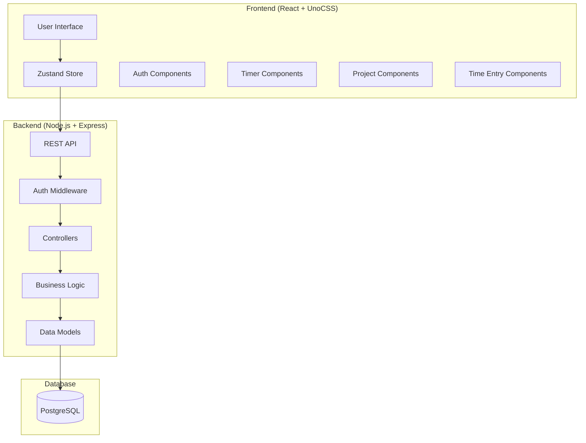

# Timer App Design Document

## Overview

The Timer App is a full-stack time tracking application built with React frontend and Node.js backend. The system provides real-time timer functionality, manual time entry management, project organization, and time reporting capabilities. The architecture follows a RESTful API design with JWT authentication and PostgreSQL for data persistence.

## Architecture

### System Architecture



### Technology Stack

- **Frontend**: React 18, UnoCSS for styling, Zustand for state management
- **Backend**: Node.js, Express.js, TypeScript
- **Database**: PostgreSQL with connection pooling
- **Authentication**: JWT tokens with bcrypt password hashing
- **API**: RESTful endpoints with JSON responses

## Components and Interfaces

### Frontend Components

#### Core Components
- **App**: Main application wrapper with routing
- **AuthProvider**: JWT token management and user context
- **TimerBar**: Live timer controls and elapsed time display
- **Dashboard**: Today's summary and recent entries
- **ProjectManager**: CRUD interface for projects
- **TimeEntryForm**: Manual entry creation and editing
- **TimeEntryList**: Display and manage time entries

#### Zustand Store Structure
```typescript
interface AppState {
  // Auth state
  user: User | null;
  token: string | null;
  
  // Timer state
  activeTimer: ActiveTimer | null;
  elapsedTime: number;
  
  // Data state
  projects: Project[];
  timeEntries: TimeEntry[];
  
  // UI state
  isLoading: boolean;
  error: string | null;
  
  // Actions
  login: (credentials: LoginCredentials) => Promise<void>;
  logout: () => void;
  startTimer: (timerData: StartTimerData) => Promise<void>;
  stopTimer: () => Promise<void>;
  fetchProjects: () => Promise<void>;
  createProject: (project: CreateProjectData) => Promise<void>;
  fetchTimeEntries: (date?: string) => Promise<void>;
  createTimeEntry: (entry: CreateTimeEntryData) => Promise<void>;
}
```

### Backend API Structure

#### Controllers
- **AuthController**: Handle authentication endpoints
- **TimerController**: Manage active timer operations
- **ProjectController**: CRUD operations for projects
- **TimeEntryController**: Manage time entry operations

#### Services
- **AuthService**: JWT token generation/validation, password hashing
- **TimerService**: Business logic for timer operations
- **ProjectService**: Project management logic
- **TimeEntryService**: Time entry calculations and validation

#### Middleware
- **authMiddleware**: JWT token validation
- **errorHandler**: Centralized error handling
- **requestLogger**: API request logging

## Data Models

### Database Schema

```sql
-- Users table
CREATE TABLE users (
    id SERIAL PRIMARY KEY,
    name VARCHAR(255) NOT NULL,
    email VARCHAR(255) UNIQUE NOT NULL,
    password_hash VARCHAR(255) NOT NULL,
    created_at TIMESTAMP DEFAULT CURRENT_TIMESTAMP
);

-- Projects table
CREATE TABLE projects (
    id SERIAL PRIMARY KEY,
    user_id INTEGER REFERENCES users(id) ON DELETE CASCADE,
    name VARCHAR(255) NOT NULL,
    color VARCHAR(7) NOT NULL, -- Hex color code
    created_at TIMESTAMP DEFAULT CURRENT_TIMESTAMP
);

-- Time entries table
CREATE TABLE time_entries (
    id SERIAL PRIMARY KEY,
    user_id INTEGER REFERENCES users(id) ON DELETE CASCADE,
    project_id INTEGER REFERENCES projects(id) ON DELETE SET NULL,
    task_name VARCHAR(255) NOT NULL,
    start_time TIMESTAMP NOT NULL,
    end_time TIMESTAMP NOT NULL,
    duration INTEGER NOT NULL, -- Duration in seconds
    created_at TIMESTAMP DEFAULT CURRENT_TIMESTAMP,
    CONSTRAINT valid_time_range CHECK (end_time > start_time)
);

-- Active timers table
CREATE TABLE active_timers (
    id SERIAL PRIMARY KEY,
    user_id INTEGER REFERENCES users(id) ON DELETE CASCADE UNIQUE,
    project_id INTEGER REFERENCES projects(id) ON DELETE SET NULL,
    task_name VARCHAR(255) NOT NULL,
    start_time TIMESTAMP NOT NULL DEFAULT CURRENT_TIMESTAMP
);
```

### TypeScript Interfaces

```typescript
interface User {
  id: number;
  name: string;
  email: string;
  createdAt: Date;
}

interface Project {
  id: number;
  userId: number;
  name: string;
  color: string;
  createdAt: Date;
}

interface TimeEntry {
  id: number;
  userId: number;
  projectId?: number;
  taskName: string;
  startTime: Date;
  endTime: Date;
  duration: number; // in seconds
  createdAt: Date;
  project?: Project;
}

interface ActiveTimer {
  id: number;
  userId: number;
  projectId?: number;
  taskName: string;
  startTime: Date;
  project?: Project;
}
```

## API Endpoints

### Authentication Endpoints
- `POST /api/auth/signup` - User registration
- `POST /api/auth/login` - User authentication
- `POST /api/auth/logout` - Session termination

### Timer Endpoints
- `POST /api/timer/start` - Start active timer
- `POST /api/timer/stop` - Stop active timer and create time entry
- `GET /api/timer/active` - Get current active timer

### Project Endpoints
- `GET /api/projects` - Get user's projects
- `POST /api/projects` - Create new project
- `PUT /api/projects/:id` - Update project
- `DELETE /api/projects/:id` - Delete project

### Time Entry Endpoints
- `GET /api/time-entries` - Get time entries (with optional date filter)
- `POST /api/time-entries` - Create manual time entry
- `PUT /api/time-entries/:id` - Update time entry
- `DELETE /api/time-entries/:id` - Delete time entry

## Error Handling

### Frontend Error Handling
- Global error boundary for React component errors
- Zustand store error state management
- Toast notifications for user feedback
- Form validation with error display
- Network error handling with retry mechanisms

### Backend Error Handling
- Centralized error middleware
- Structured error responses with consistent format
- Input validation using express-validator
- Database constraint error handling
- JWT token validation errors

### Error Response Format
```typescript
interface ErrorResponse {
  success: false;
  error: {
    message: string;
    code: string;
    details?: any;
  };
}
```

## Testing Strategy

### Frontend Testing
- **Unit Tests**: Component testing with React Testing Library
- **Integration Tests**: Zustand store actions and API integration
- **E2E Tests**: Critical user flows with Playwright
- **Visual Tests**: Component snapshots for UI consistency

### Backend Testing
- **Unit Tests**: Service layer business logic
- **Integration Tests**: API endpoints with test database
- **Database Tests**: Model operations and constraints
- **Authentication Tests**: JWT token handling and middleware

### Test Coverage Goals
- Minimum 80% code coverage for critical paths
- 100% coverage for authentication and timer logic
- All API endpoints tested with success and error cases
- Database constraint validation testing

## Security Considerations

### Authentication Security
- JWT tokens with reasonable expiration times
- Secure password hashing with bcrypt (minimum 12 rounds)
- Input sanitization and validation
- Rate limiting on authentication endpoints

### Data Security
- User data isolation (users can only access their own data)
- SQL injection prevention with parameterized queries
- CORS configuration for frontend-backend communication
- Environment variable management for sensitive configuration

### Frontend Security
- XSS prevention through React's built-in protections
- Secure token storage considerations
- Input validation on all forms
- Secure API communication over HTTPS

## Performance Considerations

### Frontend Performance
- Component memoization for expensive renders
- Efficient Zustand store updates
- Lazy loading for non-critical components
- Optimized bundle size with tree shaking

### Backend Performance
- Database connection pooling
- Efficient queries with proper indexing
- Response caching where appropriate
- Pagination for large data sets

### Real-time Updates
- Efficient timer updates without excessive API calls
- Local state management for timer display
- Optimistic updates for better user experience
- Background sync for offline scenarios